## Startpage

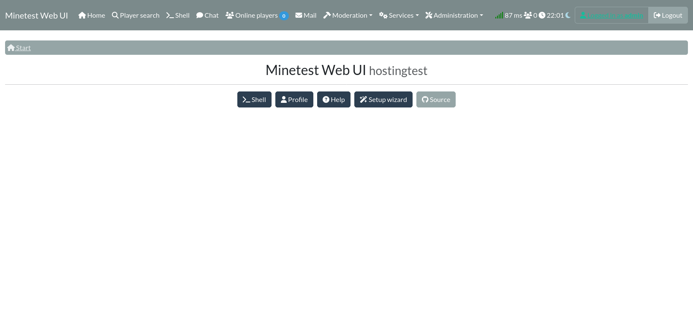

## Player search

Search players by name

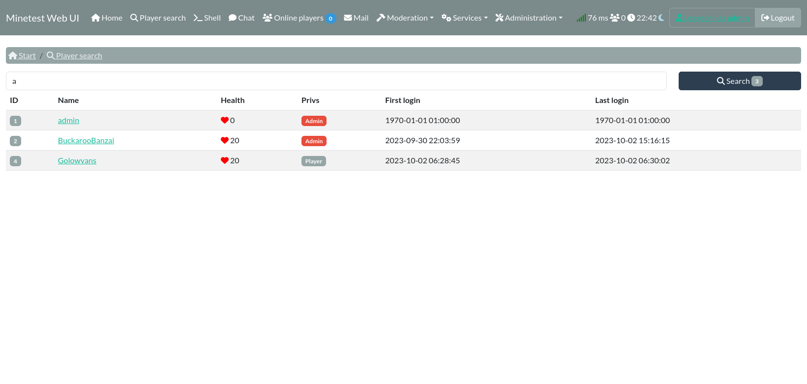

## Chat commands

Execute chat-commands from the ui

## Chat

Join the discussion on the server

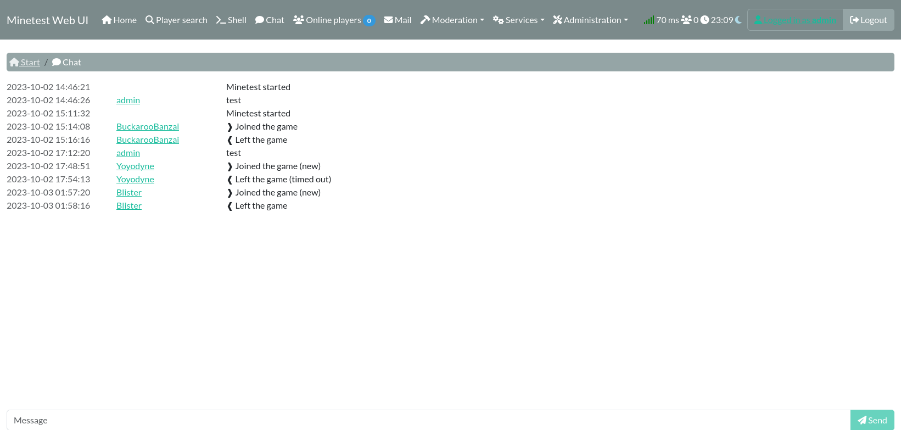

## Mail integration

Send and view mails

* Mod: https://content.minetest.net/packages/mt-mods/mail/

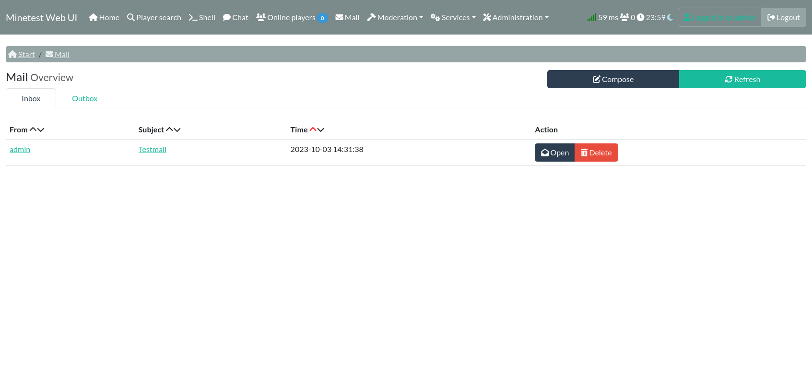

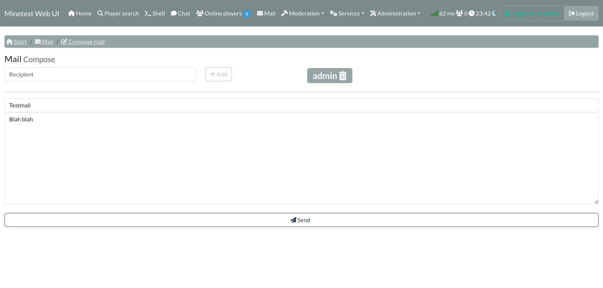

## Skin management

Upload your own skins

* Mod: https://content.minetest.net/packages/bell07/skinsdb/

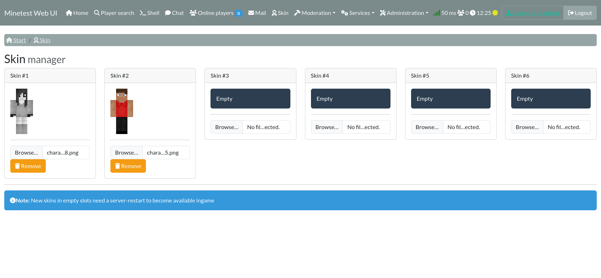

## XBan integration

Manage difficult players

* Mod: https://content.minetest.net/packages/kaeza/xban2/

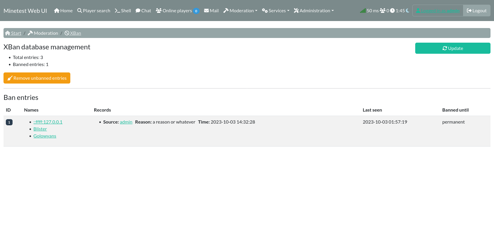

## Logs

Browse all kinds of logs

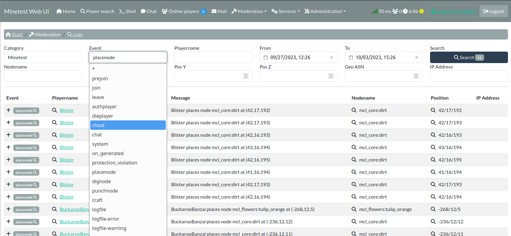

## Engine control

Install, start and stop the minetest engine

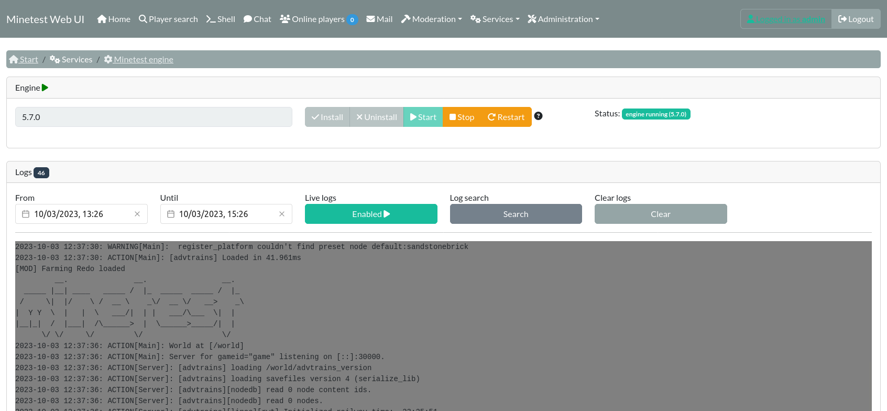

## Filebrowser

Up- and download files

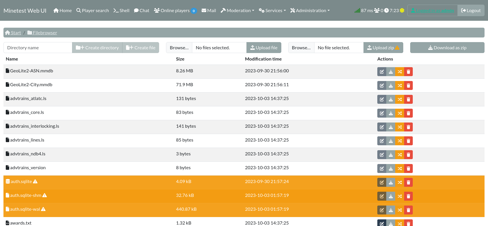

## Feature toggling

Enable and disable UI features (some are still experimental!)

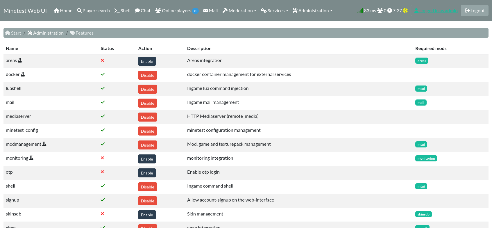

## Lua code injection

Inject code into the running server

## Config/Settings management

Manage your `minetest.conf`

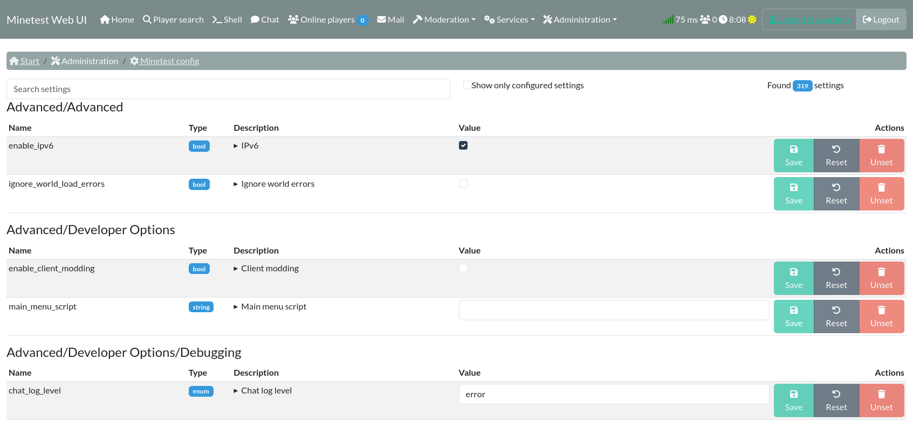

## Mod management

Add, remove and update your mods

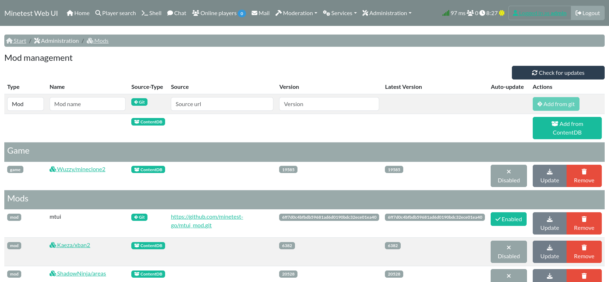

## Remote media server

Builtin HTTP Remote media server to offload media-transfers from clients

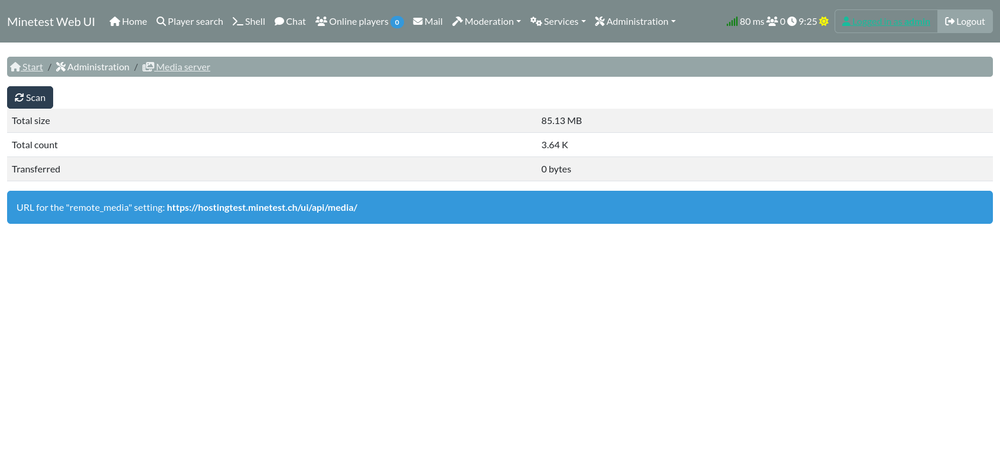

## Maintenance mode

For consistent backups

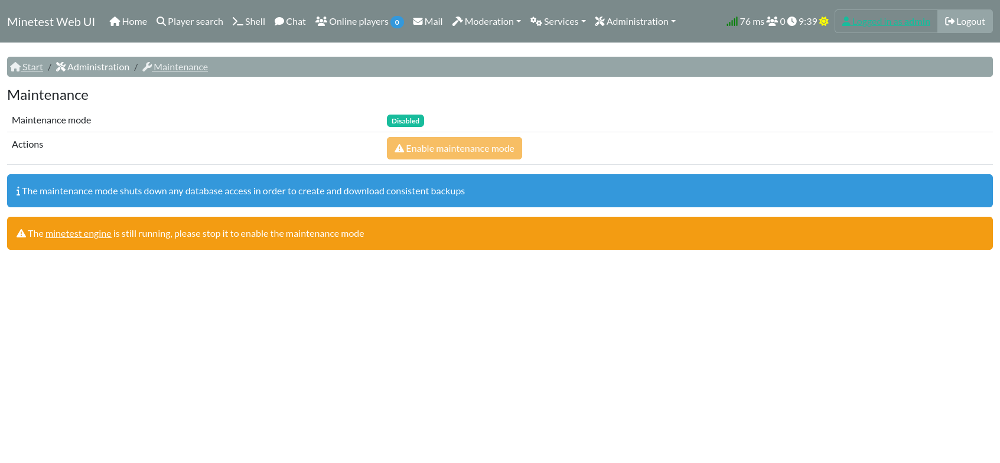